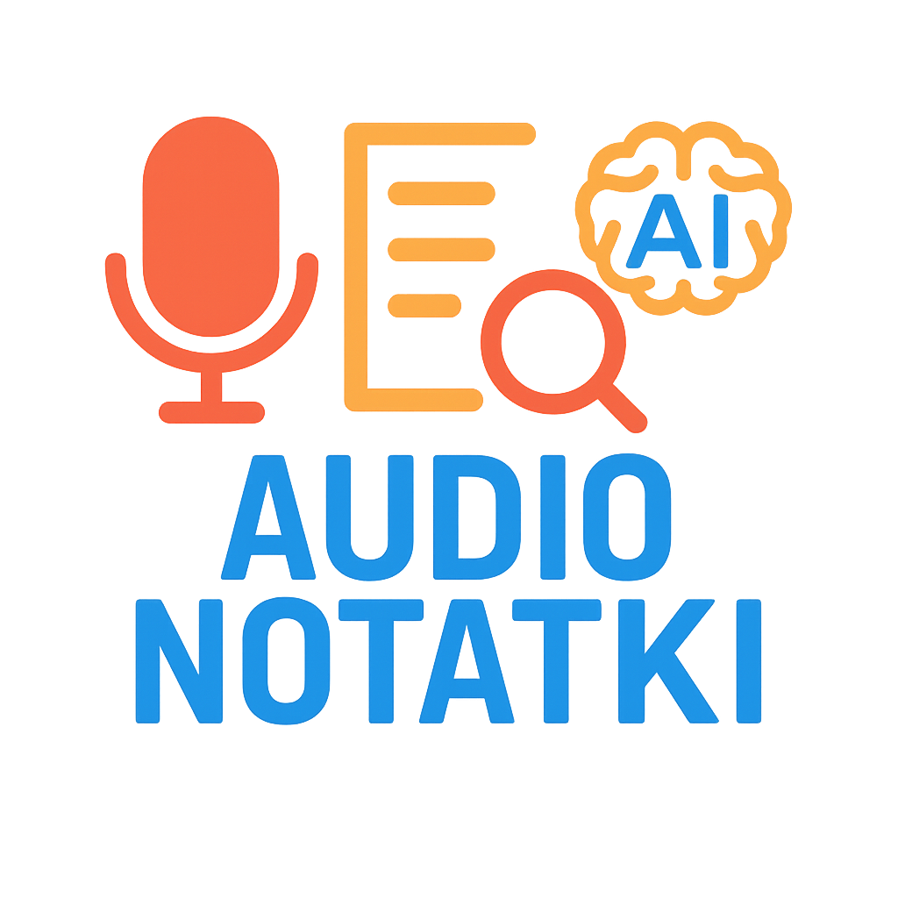

---
hide:
    - toc
---

# Audionotatki

    <a href="https://nagraj.streamlit.app/" 
       target="_blank" 
       rel="noopener noreferrer"
       style="display: inline-block; 
              background-color: #ff4b4b; 
              color: white; 
              padding: 15px 30px; 
              text-decoration: none; 
              border-radius: 8px; 
              font-size: 18px; 
              font-weight: bold;
              box-shadow: 0 4px 8px rgba(0,0,0,0.2);
              transition: all 0.3s ease;">
        🔗 Przejdź do aplikacji
    </a>

### Audio Notatki to aplikacja, która służy do nagrywania notatek głosowych z automatyczną transkrypcją nagrania do tekstu z użyciem modelu OpenAI Whisper. Zapis tekstu notatek w postaci wektorowej do bazy danych (embeddings). Każdy zalogowany użytkownik, posiada własną kolekcję notatek. Zapisane notatki można wyszukiwać semantycznie, edytować, usuwać. Aplikacja obsługuje wiele języków.

#### Aby przetestować aplikację zaloguj się. Nazwa użytkownika: test, Hasło: test
#### Po zalogowaniu w bazie znajdziesz już kilka notatek z przepisami kulinarnymi, do przetestowania.

    Wykorzystane technologie i biblioteki
    * Streamlit
    * Python
    * Openai
    * Qdrant
    * Github    

