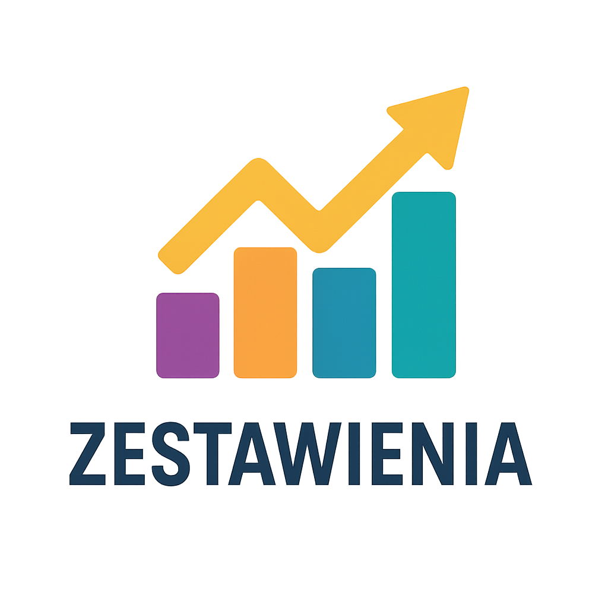
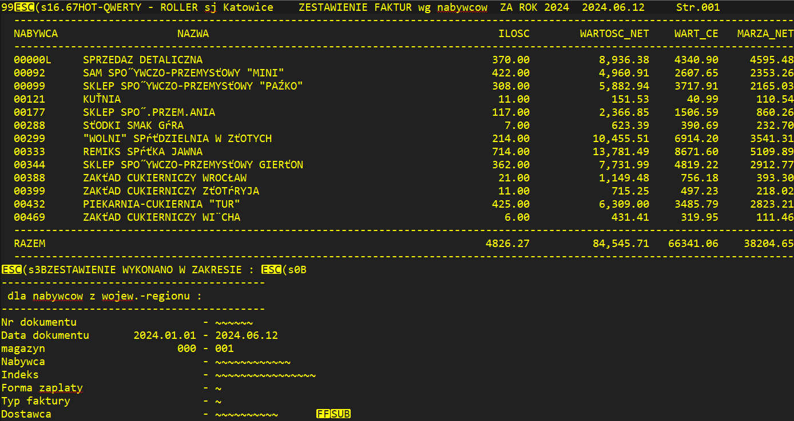
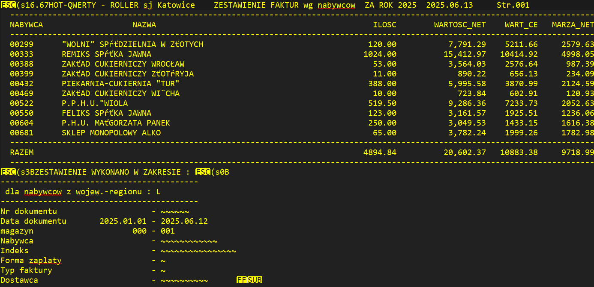
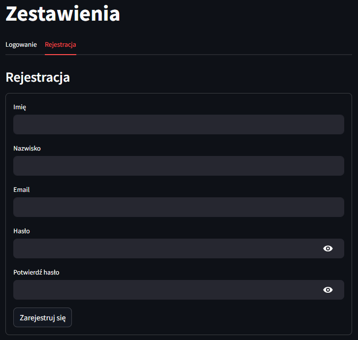
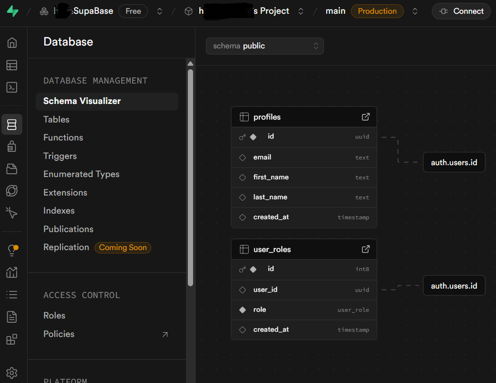

---
hide:
    - toc
---

# Zestawienia 

    <a href="https://zestawienia.streamlit.app/" 
       target="_blank" 
       rel="noopener noreferrer"
       style="display: inline-block; 
              background-color: #ff4b4b; 
              color: white; 
              padding: 15px 30px; 
              text-decoration: none; 
              border-radius: 8px; 
              font-size: 18px; 
              font-weight: bold;
              box-shadow: 0 4px 8px rgba(0,0,0,0.2);
              transition: all 0.3s ease;">
        🔗 Zestawienia
    </a>

### Interaktywna aplikacja do analizy sprzedaży, zbudowana w Streamlit. Po wczytaniu plików przez użytkownika przetwarza je za pomocą narzędzi (Pandas/NumPy) i prezentuje czytelne statystyki oraz porównawcze wykresy (Plotly), Umożliwia filtrowanie okresów oraz dynamiczne wizualizacje zmian w przychodach, marży i wolumenie klientów między dwoma wczytanymi raportami. Na potrzeby prezentacji automatycznie pobiera pliki raportów (Supabase Storage). 

### Narzędzie to jest przygotowane indywidualnie pod specyficzne raporty jakie otrzymuje klient ze swojego systemu (plik tekstowy, bez tabel, kolumn, czy separatorów), przykład:

### Jest też system rejestracji i logowania użytkownika (Supabase Authentication), jednak na potrzeby prezentacji aplikacji wyłączony. Przykład:

    Wykorzystane technologie i biblioteki
    * Python 
    * Streamlit
    * Pandas
    * NumPy
    * Plotly
    * Supabase Storage
    * Supabase Auth
    * Github  

